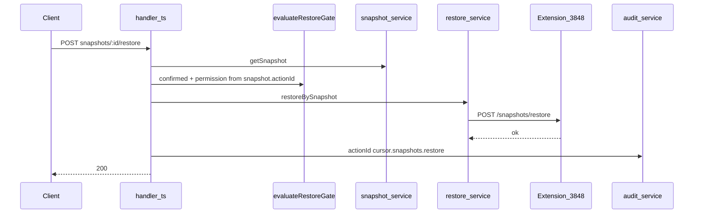

# Bridge Cursor Adapter — P0.1a Abschlussbericht

**Status:** Abgeschlossen (technisch)  
**Datum:** 2026-05-27  
**Registry-Version:** `poc-v1.2.0`  
**Basis:** [P0 Abschlussbericht](p0-completion-report.md) (Restore dort: 501), P0.1a MVP, Remediation (Test-Isolation + Restore-Hardening)  
**Referenz:** [p0.1-manual-testing.md](p0.1-manual-testing.md), [shared/src/cursor-contract.ts](../../shared/src/cursor-contract.ts)

---

## Was wurde umgesetzt?

P0.1a ergänzt P0 um **Snapshot Restore** als Meta-API — ohne UI, ohne 11. Registry-Action, ohne Terminal/Agent/WS.

| Deliverable | Kurzbeschreibung |
|-------------|------------------|
| Meta-Restore-API | `POST /api/v1/cursor/snapshots/:snapshotId/restore` mit `confirmed: true` |
| Restore settings.set | Extension primär; FS-Fallback nur workspace (`.vscode/settings.json`) |
| Restore fs.write | Nur Overwrite-Snapshot `{ path, content }`; Extension erforderlich |
| Restore-Gate | `evaluateRestoreGate` (Permissions/Confirmation aus Original-Action, kein Router-Execute) |
| Extension IPC | `POST /snapshots/restore` auf IDE Control Host |
| Contract / Registry | `rollbackAvailable: boolean`; `poc-v1.2.0`; `snapshotRestoreAvailable: true` auf `/version` |
| Audit | Feste Meta-`actionId` `cursor.snapshots.restore` (nicht in `P0_ACTION_IDS`) |

**Restore-Pipeline (Meta-API, nicht Capability Router):**



Snapshots bleiben nach erfolgreichem Restore erhalten (idempotentes Retry).

---

## Explizit nicht in P0.1a

- **workspace.open** Restore (Payload unvollständig für Fenster/Multi-Root) → P0.1b
- Terminal-Whitelist-Erweiterung, Agent Extension-Fallback, WebSocket-Events, UI, P1-Proposal-Runtime
- Kein Registry-Eintrag `cursor.snapshots.restore` in `poc-v1-actions.json`

---

## Wichtige Dateien

| Bereich | Pfade |
|---------|--------|
| Adapter | `adapters/cursor/src/snapshots/restore-service.ts`, `restore-gate.ts`, `snapshot-service.ts` |
| API | `api/src/cursor/handler.ts`, `extension-client.ts` |
| Extension | `extension/src/ide/actions/restore.ts`, `extension/src/ide/ipc/handler.ts`, `constants.ts` |
| Contract | `shared/src/cursor-contract.ts` (`P0_RESTORE_ACTION_IDS`, `SNAPSHOT_NOT_FOUND`, `SNAPSHOT_UNSUPPORTED`) |
| Registry | `adapters/cursor/registry/poc-v1-actions.json` |
| Tests | `adapters/cursor/tests/restore.test.ts`, `vitest-setup.ts`; angepasste Pipeline-/Hardening-Tests |
| Doku Live | [p0.1-manual-testing.md](p0.1-manual-testing.md) |

---

## Remediation (Review-Fix)

Nach dem ersten P0.1a-Abschluss schlug `p0.test.ts` (Restore mit gemockter Extension) in `npm run test:p0` intermittierend fehl.

| Thema | Ursache | Fix |
|-------|---------|-----|
| Test-Flake | Globaler Snapshot-Ordner (User-Config) + parallele Vitest-Dateien + globales Löschen in `restore.test.ts` | `adapters/cursor/tests/vitest-setup.ts`: isoliertes `BRIDGE_USER_CONFIG_DIR` pro Test (nur Adapter-Tests) |
| fs.write Restore | Pfad nicht im Gate geprüft | `isPathAllowed` in `restore-gate.ts` vor IPC |
| settings FS-Fallback | `global` / `workspaceFolder` würden fälschlich in `.vscode/settings.json` landen | FS-Fallback nur bei `target: workspace` (sonst `EXTENSION_UNREACHABLE`) |

---

## rollbackAvailable-Matrix (P0.1a)

| actionId | rollbackAvailable P0.1a | Restore |
|----------|-------------------------|---------|
| `cursor.ide.settings.set` | **true** | MVP |
| `cursor.ide.fs.write` | **true** (nur mit Overwrite-Snapshot) | MVP |
| `cursor.ide.workspace.open` | false | P0.1b |
| `cursor.ide.fs.mkdir` | false | kein snapshotPayload |
| `cursor.ide.extension.install` | false | deferred |
| alle anderen P0-Actions | false | — |

---

## Welche Tests sind grün?

**Gesamt: 142/142** (Stand nach P0.1a + Remediation)

| Workspace | Tests |
|-----------|-------|
| `@bridge/shared` | 7/7 |
| `@bridge/cursor-adapter` | 90/90 (davon 13 in `restore.test.ts`) |
| `bridge-api` | 28/28 |
| `cursor-agent-bridge` (Extension) | 17/17 |

**Orchestrierung:**

```powershell
npm run test:p0
```

Zusätzlich verifiziert: Adapter-Suite fünfmal hintereinander bei paralleler Dateiausführung — ohne Flake (kein CI-Pflichtkriterium).

---

## Manuelle Live-Tests

Automatisierte Tests mocken Extension/IPC. Live-Verifikation in Cursor IDE steht in [p0.1-manual-testing.md](p0.1-manual-testing.md) (Restore settings/fs.write, Negative Cases, FS-Fallback-Einschränkung).

---

## Abgrenzung

| Phase | Restore-Stand |
|-------|----------------|
| **P0** ([p0-completion-report.md](p0-completion-report.md)) | Snapshots erzeugt; Restore-Endpoint 501 `ROLLBACK_NOT_AVAILABLE`; Registry `poc-v1.1.0` |
| **P0.1a** (dieser Bericht) | Restore MVP für settings.set + fs.write; Registry `poc-v1.2.0` |
| **P0.1b+** | workspace.open Restore, Terminal, WS — bewusst nicht Teil von P0.1a |
