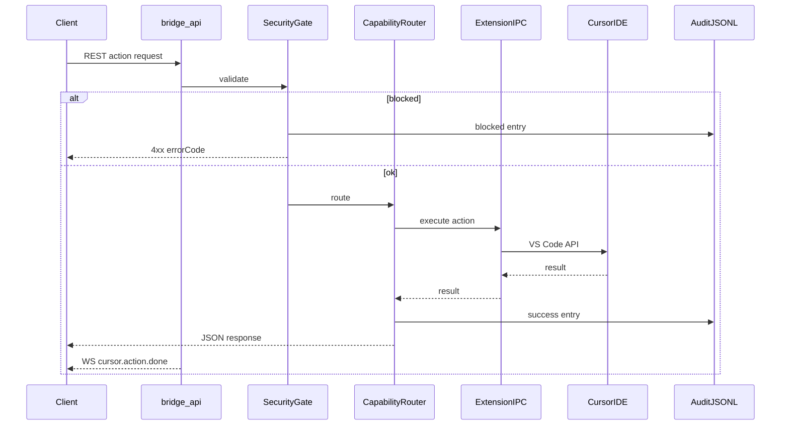

# Bridge Cursor Adapter — P1 Communication Model

**Status:** P1 (Analyse & Struktur)  
**Datum:** 2026-05-27  
**Referenz:** [phase-0-implementation-plan.md](phase-0-implementation-plan.md), [p1-phase-boundaries.md](p1-phase-boundaries.md)

Dieses Dokument beschreibt **wer mit wem**, **über welchen Kanal**, **in welche Richtung** und **unter welchen Sicherheits- und Audit-Regeln** kommuniziert. P1 implementiert keine Kanäle — nur Analyse und Planung.

---

## 1–12 — Antworten auf die Pflichtfragen

| # | Frage | Kurzantwort (P1) |
|---|--------|------------------|
| 1 | Wer kommuniziert mit wem? | Mobile/Web/CLI-Clients ↔ bridge-api ↔ Security/Router ↔ Executors ↔ Extension/CLI/FS ↔ Cursor IDE; Agent-CLI separat für Subsystem |
| 2 | Über welchen Kanal? | REST, WebSocket (events), localhost HTTP IPC, JSONL Audit, Dateisystem (Fallback) |
| 3 | Richtung? | Meist Client→Bridge→IDE; Events Bridge→Client; Extension status/capabilities IDE→Bridge (Pull) |
| 4 | Sync/Async? | REST/IPC sync; WS push async; Agent-CLI Jobs async |
| 5 | Daten erlaubt? | Action-Params, Metadaten, redigierte Audit-Felder, Registry/Version |
| 6 | Daten verboten? | Klartext-Prompts/Inhalte/Befehle/Pfade in Audit; IPC-Token im Repo; Token in Handshake |
| 7 | Security / Permission / Confirmation? | Security Gate **vor** Router (API); Confirmation im Gate; Permission Gate UI **P2** vor Render |
| 8 | Audit? | Jede Action (success/failure/blocked); paramsHash; optional WS `cursor.action.done` |
| 9 | Fehler/Status? | Strukturierte `errorCode` + HTTP-Status; `methodUsed`, `rollbackAvailable: false` |
| 10 | Live-Updates Clients? | P0: WS `cursor.action.done`; P2: erweiterte Streams (Status, Surface) |
| 11 | Kommunikation P1? | Nur Dokumentation dieses Modells + Proposals |
| 12 | Kommunikation P2+? | Modular UI Renderer, Permission Gate UI, Design-Tokens, Mobile Layout |

---

## Kanal-Katalog

Jeder Kanal: `channelId`, Quelle, Ziel, Transport, Richtung, Sync/Async, Phase, erlaubte/verbotene Daten, Security, Confirmation, Audit, Fehlermodi, Zukunft.

---

### `channel.rest.client.bridge-api`

| Feld | Wert |
|------|------|
| **source** | Mobile WebApp, CLI, Scripts, andere Bridge-Clients |
| **target** | bridge-api (`127.0.0.1:3847` oder Proxy) |
| **transport** | HTTPS/HTTP REST JSON |
| **direction** | Client → API (Request/Response) |
| **sync/async** | synchron (Request-Response) |
| **currentPhase** | **P0** (implementiert) |
| **dataAllowed** | Action-Params, `confirmed`, Bearer token, `X-Bridge-Client-Id` |
| **dataForbidden** | Unauthenticated mutating requests; Klartext-Secrets in Logs |
| **securityGatePosition** | API-Handler: Gate **vor** Router |
| **confirmationPosition** | Body `confirmed: true` wenn `needsConfirmation` |
| **auditBehavior** | Nach Ausführung oder bei `blocked` im Gate |
| **failureModes** | 401, 403, 428, 404, 409, 501, 503 |
| **futureNotes** | Rate-Limiting, scoped tokens (P1.1+) |

**Routen (P0):** `/api/v1/cursor/ide/*`, `/api/v1/cursor/agent/prompt`, `/api/v1/cursor/registry`, `/api/v1/cursor/version`, `/api/v1/cursor/audit`

---

### `channel.ws.events.clients`

| Feld | Wert |
|------|------|
| **source** | bridge-api |
| **target** | Web/Mobile/Plugin-Clients |
| **transport** | WebSocket `ws://host:3847/api/v1/events?token=...` |
| **direction** | API → Clients (push) |
| **sync/async** | asynchron |
| **currentPhase** | **P0** (teilweise): `cursor.action.done` |
| **dataAllowed** | actionId, result, durationMs, riskClass, errorCode (keine Params-Klartexte) |
| **dataForbidden** | Prompts, Dateiinhalte, Terminal-Commands, Pfade |
| **securityGatePosition** | WS-Auth via token query (bestehend) |
| **confirmationPosition** | — (Events nach Entscheidung) |
| **auditBehavior** | Spiegeln von Audit-Metadaten, nicht Voll-Audit |
| **failureModes** | Disconnect, auth failure |
| **futureNotes** | **P2:** IDE-Status-Stream, Job-Progress, `cursor.surface.changed` |

---

### `channel.api.security-gate`

| Feld | Wert |
|------|------|
| **source** | API Handler |
| **target** | Security Gate (`adapters/cursor/src/security/`) |
| **transport** | In-Process |
| **direction** | intern |
| **sync/async** | synchron |
| **currentPhase** | **P0** |
| **dataAllowed** | actionId, params, clientId, cursorVersion |
| **dataForbidden** | Bypass Allowlists |
| **securityGatePosition** | **ist** die Gate-Schicht |
| **confirmationPosition** | Prüfung `confirmed` + `externalCode` |
| **auditBehavior** | `blocked` → Audit-Eintrag |
| **failureModes** | ACTION_UNKNOWN, PERMISSION_DENIED, CONFIRMATION_REQUIRED, ALLOWLIST_VIOLATION, VERSION_INCOMPATIBLE |
| **futureNotes** | P1 dokumentiert nur; keine Änderung in P1 |

---

### `channel.api.capability-router`

| Feld | Wert |
|------|------|
| **source** | API Handler (nach Gate) |
| **target** | Capability Router |
| **transport** | In-Process |
| **direction** | intern |
| **sync/async** | synchron |
| **currentPhase** | **P0** |
| **dataAllowed** | ExecutionContext, Registry-Action, fallback chain |
| **dataForbidden** | Unregistered actionId |
| **securityGatePosition** | nach Gate (nie davor umgehen) |
| **confirmationPosition** | bereits im Gate |
| **auditBehavior** | liefert `methodUsed` |
| **failureModes** | EXTENSION_UNREACHABLE → Fallback oder Fail; METHOD_BLOCKED |
| **futureNotes** | Composite-Methoden P0.1+ |

---

### `channel.router.extension-executor`

| Feld | Wert |
|------|------|
| **source** | Capability Router |
| **target** | Extension Executor → Extension IPC Client |
| **transport** | HTTP JSON localhost |
| **direction** | API → Extension (`127.0.0.1:3848`) |
| **sync/async** | synchron (Timeout ~30s) |
| **currentPhase** | **P0** |
| **dataAllowed** | `{ actionId, params, requestId }`, Header `X-Bridge-Ipc-Token` |
| **dataForbidden** | Token in Projekt/git; Bind 0.0.0.0 |
| **securityGatePosition** | Gate bereits passiert; IPC-Token zusätzlich |
| **confirmationPosition** | — |
| **auditBehavior** | methodUsed: extension-api / extension-command |
| **failureModes** | IPC timeout, 401 IPC, Circuit breaker ~30s |
| **futureNotes** | Größere Bodies für Writes konfigurierbar |

---

### `channel.router.cli-executor`

| Feld | Wert |
|------|------|
| **source** | Capability Router |
| **target** | CliExecutor (`cursor`, `agent` binaries) |
| **transport** | child_process |
| **direction** | API → OS-Prozesse |
| **sync/async** | synchron (Agent-Jobs können intern async sein) |
| **currentPhase** | **P0** |
| **dataAllowed** | Spec-konforme CLI-Args; Agent ohne `--force` wenn `allowFileChanges: false` |
| **dataForbidden** | Freie Shell ohne Allowlist |
| **securityGatePosition** | nach Gate; Agent-Policy zusätzlich |
| **confirmationPosition** | Gate + Agent-Opt-in |
| **auditBehavior** | methodUsed: cli; Prompt gehasht |
| **failureModes** | Binary not found, non-zero exit |
| **futureNotes** | — |

---

### `channel.router.filesystem-executor`

| Feld | Wert |
|------|------|
| **source** | Capability Router |
| **target** | FilesystemExecutor (Node fs) |
| **transport** | lokales Dateisystem |
| **direction** | API → FS |
| **sync/async** | synchron |
| **currentPhase** | **P0** (Fallback only) |
| **dataAllowed** | Pfade in `BRIDGE_ALLOWED_PATHS` |
| **dataForbidden** | Pfade außerhalb Allowlist |
| **securityGatePosition** | Path-Allowlist im Gate + Executor |
| **confirmationPosition** | wie Action |
| **auditBehavior** | methodUsed: filesystem |
| **failureModes** | ENOENT, EACCES |
| **futureNotes** | — |

---

### `channel.api.extension-ipc`

| Feld | Wert |
|------|------|
| **source** | bridge-api Extension Client |
| **target** | Extension IDE-Control-Host |
| **transport** | HTTP `127.0.0.1:3848` |
| **direction** | bidirektional (Request/Response); Discovery via Handshake-Datei |
| **sync/async** | synchron |
| **currentPhase** | **P0** |
| **dataAllowed** | `/health`, `/capabilities`, `/actions/execute` |
| **dataForbidden** | Token in `bridge-ide-control-handshake.json` |
| **securityGatePosition** | API-seitig bereits gegated |
| **confirmationPosition** | — |
| **auditBehavior** | indirekt über API Audit |
| **failureModes** | Extension offline → Fallback-Routing |
| **futureNotes** | — |

---

### `channel.extension.ipc.vscode-api`

| Feld | Wert |
|------|------|
| **source** | Extension Action Handlers |
| **target** | VS Code / Cursor Extension API |
| **transport** | In-Process API |
| **direction** | Extension → IDE |
| **sync/async** | synchron (meist) |
| **currentPhase** | **P0** (Actions 1–9) |
| **dataAllowed** | URIs, Configuration, Commands, Terminals, Diagnostics counts |
| **dataForbidden** | Unbounded diagnostic messages in Bridge-Audit |
| **securityGatePosition** | Extension-seitige pathGuard/allowlists |
| **confirmationPosition** | — (bereits API) |
| **auditBehavior** | Result zurück an API |
| **failureModes** | Command not found, API unavailable |
| **futureNotes** | Surface-Reader nutzt subset (later) |

---

### `channel.api.audit`

| Feld | Wert |
|------|------|
| **source** | API + Adapter Redaction |
| **target** | `{userConfigDir}/.bridge/audit/cursor-actions.jsonl` |
| **transport** | Append-only Datei |
| **direction** | Bridge → Persistenz |
| **sync/async** | synchron (nach Action) |
| **currentPhase** | **P0** |
| **dataAllowed** | actionId, timestamp, clientId, paramsHash, result, methodUsed, durationMs, errorCode, snapshotId, riskClass |
| **dataForbidden** | Klartext prompt/content/command/path/settings-value (default) |
| **securityGatePosition** | — |
| **confirmationPosition** | — |
| **auditBehavior** | immer; DEBUG max 200 Zeichen Preview |
| **failureModes** | Disk full (log error, don't block action) |
| **futureNotes** | Export, Filter-API |

---

### `channel.api.snapshots`

| Feld | Wert |
|------|------|
| **source** | Snapshot Service |
| **target** | `{userConfigDir}/.bridge/snapshots/{id}.json` |
| **transport** | Datei |
| **direction** | Bridge → Persistenz |
| **sync/async** | synchron (vor Action) |
| **currentPhase** | **P0** create; **P0.1** restore |
| **dataAllowed** | Snapshot-Inhalt user-config only (nicht in Audit-Klartext) |
| **dataForbidden** | Snapshot-Inhalt in API Audit |
| **securityGatePosition** | — |
| **confirmationPosition** | — |
| **auditBehavior** | nur snapshotId-Referenz |
| **failureModes** | Restore → **501 ROLLBACK_NOT_AVAILABLE** (P0) |
| **futureNotes** | Restore-Kanal REST P0.1 |

---

### `channel.future.modular-ui-renderer`

| Feld | Wert |
|------|------|
| **source** | Modular UI Renderer |
| **target** | Action Registry + Capability Metadaten (+ bridge-api) |
| **transport** | In-App + REST (read) |
| **direction** | UI ↔ Registry/API |
| **sync/async** | synchron (render); async (actions) |
| **currentPhase** | **P2** (geplant) |
| **dataAllowed** | Registry, permissions, module specs, action results |
| **dataForbidden** | Hardcoded fetch ohne actionId |
| **securityGatePosition** | API Gate bleibt; UI Permission Gate **vor** Render/Submit |
| **confirmationPosition** | ConfirmationDialogModule |
| **auditBehavior** | Anzeige aus GET audit (redigiert) |
| **failureModes** | Module missing tokens → block render |
| **futureNotes** | Siehe [p1-ui-modules.proposal.json](../../adapters/cursor/registry/p1-ui-modules.proposal.json) |

---

### `channel.extension.status-capabilities`

| Feld | Wert |
|------|------|
| **source** | Extension IPC Server |
| **target** | bridge-api (pull) |
| **transport** | HTTP GET |
| **direction** | Extension → API (abfrageend) |
| **sync/async** | synchron |
| **currentPhase** | **P0** |
| **dataAllowed** | Version, capabilities[], ok flag |
| **dataForbidden** | Workspace-Inhalte in /capabilities |
| **securityGatePosition** | IPC token |
| **confirmationPosition** | — |
| **auditBehavior** | — |
| **failureModes** | unhealthy → CLI fallback für status |
| **futureNotes** | — |

---

### `channel.agent-cli.bridge-api`

| Feld | Wert |
|------|------|
| **source** | Agent CLI (`agent` binary) |
| **target** | bridge-api (Orchestrierung) |
| **transport** | child_process + API Response |
| **direction** | API → CLI → API (output) |
| **sync/async** | async Jobs möglich |
| **currentPhase** | **P0** (Action 10 primär) |
| **dataAllowed** | prompt (verarbeitet), mode, flags per policy |
| **dataForbidden** | `--force` ohne allowFileChanges |
| **securityGatePosition** | Gate + agent-policy |
| **confirmationPosition** | confirmed required |
| **auditBehavior** | prompt hash only |
| **failureModes** | CLI missing → extension-command fallback (experimental) |
| **futureNotes** | P0.1 Extension path |

**Legacy:** `POST /api/v1/prompt` deprecated → `/api/v1/cursor/agent/prompt`

---

### `channel.future.interface-reader.bridge-api`

| Feld | Wert |
|------|------|
| **source** | Interface Reader (nicht implementiert) |
| **target** | bridge-api |
| **transport** | REST (proposed) |
| **direction** | Reader → API |
| **sync/async** | synchron (poll) / async (events) |
| **currentPhase** | **P1** Konzept; **later** Implementierung |
| **dataAllowed** | SurfaceState, panel visibility (keine Screenshots default) |
| **dataForbidden** | Screenshots/OCR in Audit; Composer-Inhalt Klartext |
| **securityGatePosition** | read + evtl. surface-read permission |
| **confirmationPosition** | konfigurierbar |
| **auditBehavior** | nur Aggregat/Hashes |
| **failureModes** | unreliable surface → degrade gracefully |
| **futureNotes** | [p1-interface-reader-concept.md](p1-interface-reader-concept.md) |

---

### `channel.future.mobile-ui.action-registry`

| Feld | Wert |
|------|------|
| **source** | Mobile UI Modules |
| **target** | Action Registry (via Renderer) |
| **transport** | In-App binding |
| **direction** | Module → actionId → API |
| **sync/async** | async actions |
| **currentPhase** | **P2** |
| **dataAllowed** | moduleId, supportedActions, emittedEvents |
| **dataForbidden** | Monolith page routing |
| **securityGatePosition** | API + UI Permission Gate |
| **confirmationPosition** | per module confirmationRules |
| **auditBehavior** | AuditHistoryModule read-only |
| **failureModes** | missing design tokens → nicht rendern |
| **futureNotes** | proposalOnly in P1 |

---

## Gesamtfluss (P0 heute)

---

## Permission Gate vs. Security Gate

| Schicht | Phase | Ort | Zweck |
|---------|-------|-----|-------|
| **Security Gate** | P0 | API (Server) | Jede Request: Registry, Permission, Allowlist, Confirmation |
| **Permission Gate** | P2 | Mobile/Web UI | Modul sichtbar/ausführbar basierend auf Client-Permissions |

P1 definiert beide; implementiert ist nur Security Gate.

---

## Verwandte Dokumente

- [p1-control-domains.md](p1-control-domains.md)
- [p1-interface-reader-concept.md](p1-interface-reader-concept.md)
- [p1-phase-boundaries.md](p1-phase-boundaries.md)
