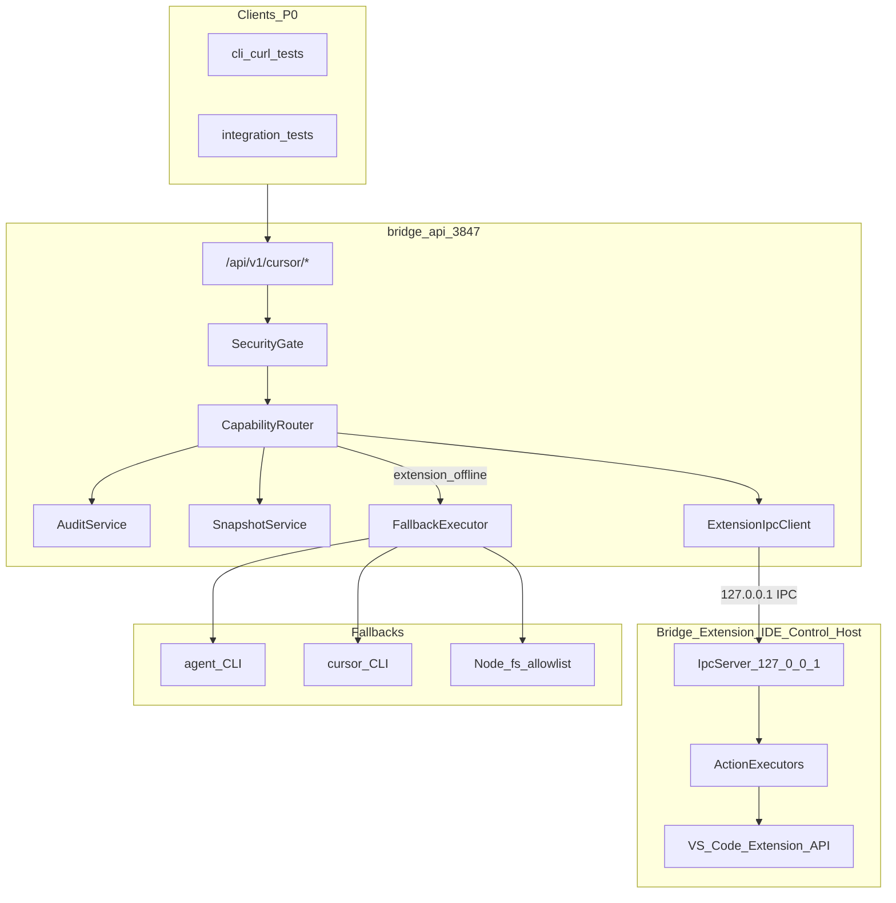
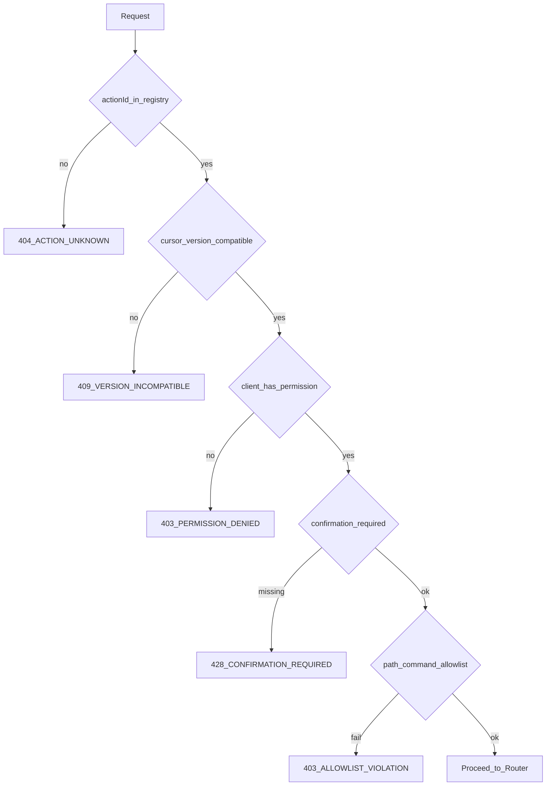

# Bridge P0 — Phase-0-Implementierungsplan (Cursor Adapter)

**Status:** Freigegeben (mit Sicherheits-Ergänzungen)  
**Version:** `p0-plan-v1.0.0`  
**Datum:** 2026-05-27  

**Referenz-Spec:** [`poc-v1-spec.md`](poc-v1-spec.md) (`poc-v1.1.0`)

**Bestehender Code (wiederverwenden, nicht ersetzen):**

- [`api/src/server.ts`](../../api/src/server.ts) — HTTP-Server, Bearer-Auth, WebSocket
- [`shared/src/api-contract.ts`](../../shared/src/api-contract.ts) — API v1 Verträge
- [`shared/src/router.ts`](../../shared/src/router.ts) — **Integration-Intent-Router** (nicht Action-Router; bleibt unberührt)
- [`extension/src/agentControl.ts`](../../extension/src/agentControl.ts) — Agent-Fallback-Logik für Action 10
- [`shared/src/max-access.ts`](../../shared/src/max-access.ts) — Max-Access-Marker (ergänzt Security Gate, ersetzt es nicht)

---

## 1. Ziel von P0

P0 liefert die **technische Capability-Foundation**, damit alle **10 PoC-Actions** aus der Spec über eine einheitliche Pipeline ausführbar, abgesichert, versioniert und auditierbar sind — **ohne UI**.

**Konkrete Deliverables:**

| Deliverable | Beschreibung |
|-------------|--------------|
| Action Registry | Maschinenlesbare Definition aller 10 Actions mit Pflichtfeldern |
| Capability Router | Extension-first Routing + dokumentierte Fallbacks |
| Security Gate | Auth, Permissions, Allowlists, Confirmation-Enforcement |
| IDE-Control-Host | Bridge Extension als localhost IPC-Endpunkt für IDE-Steuerung |
| localhost IPC | Sicheres Protokoll API ↔ Extension (127.0.0.1 only) |
| Audit/History | Persistente Action-Historie pro Request (ohne sensible Inhalte) |
| Versionierung | Registry-Version, Cursor-Compatibility-Checks, Snapshots (Erzeugung only) |
| Testplan | Testmatrix für 10 Actions + dokumentierte Fallbacks |

**Erfolgskriterium P0:** Jede der 10 Actions ist per REST (`/api/v1/cursor/*`) aufrufbar, durchläuft Security Gate + Router, wird in Audit geloggt, und primäre Extension-Ausführung ist nachweisbar testbar (CLI/curl/Integrationstests — keine Mobile UI).

---

## 2. Nicht-Ziele

Explizit **nicht** in P0:

- Keine fertige WebApp / kein Modular UI Renderer
- Kein `poc-v1-ui-modules.json` und keine UI-Modul-Implementierung
- Keine Designrules-Audit-Umsetzung (nur Blocker identifizieren)
- Keine Phase-1 Self-Structure, kein Interface Reader
- Keine monolithische Cursor-Control-Seite
- Keine GUI-Automation (Clipboard/UI-Simulation außer dokumentiertem Agent-Fallback)
- Keine riskanten Actions ohne Security Gate (Terminal, Commands, Agent)
- Kein `bridge_archive`, kein `adapters/cursor/cursor/`
- Keine neuen Actions über die 10 hinaus (Rollback-Action `cursor.ide.settings.rollback` → P0.1)
- **Kein vollständiger Snapshot-Restore / automatischer Rollback** (nur Snapshot-Erzeugung)
- **Keine freie `node`/`npx`-Terminal-Ausführung** (nur explizit gelistete Commands)
- **Kein IPC-Token im Klartext** in Projektordner oder `.cursor/`

---

## 3. Zielarchitektur



**Request-Pipeline (jede Action):**

```
HTTP Request
  → Auth (Bearer BRIDGE_API_TOKEN)
  → Parse actionId (explizit oder aus Route abgeleitet)
  → Security Gate (Registry, Permission, Allowlist, Confirmation, Compatibility)
  → Capability Router (Primärmethode wählen, Fallback wenn nötig)
  → Executor (Extension IPC | CLI | Filesystem)
  → Snapshot erzeugen (falls rollbackPossible — Restore erst P0.1)
  → Audit Log (gehasht/gekürzt, keine sensiblen Inhalte)
  → JSON Response
```

**Abgrenzung zum bestehenden System:**

- `POST /api/v1/prompt` bleibt Legacy-Orchestrierung; Cursor-Actions laufen über **neue** `/api/v1/cursor/*`-Routen
- `shared/src/router.ts` (Integration-Intent) bleibt unverändert; neuer **Action-Capability-Router** lebt im Cursor-Adapter

**UI-Pipeline (später, nach P0):**

```
Action Registry → Capability Router → Permission Gate → Modular UI Renderer
```

P0 baut die **linken drei Schichten** API-seitig; der UI Renderer konsumiert später Registry + Capability-Metadaten, ohne P0-Code umzubauen.

---

## 4. Action Registry

**Datei:** `adapters/cursor/registry/poc-v1-actions.json`

**Schema:** Alle Pflichtfelder aus Spec (actionId, domain, method, stability, requiredPermission, destructive, needsConfirmation, rollbackPossible, supportedCursorVersions, fallbackMethods).

**Zusätzliche Registry-Dateien (P0):**

| Datei | Inhalt |
|-------|--------|
| `adapters/cursor/registry/poc-v1-commands.json` | Allowlist für `cursor.ide.command.execute` |
| `adapters/cursor/registry/poc-v1-terminal-whitelist.json` | **Exakte Command-Liste** für `cursor.ide.terminal.run` (siehe Abschnitt 6) |
| `adapters/cursor/registry/poc-v1-permissions.json` | Default-Client-Permissions (Mapping clientId → permissions[]) |

**TypeScript-Loader:** `adapters/cursor/src/registry/load-registry.ts`

- Lädt JSON zur Laufzeit (Dev) oder bundled (Prod)
- Validiert Schema (Zod oder handgeschriebene Guards)
- Exportiert `getAction(actionId)`, `listActions()`, `getRegistryVersion()`

**Die 10 Actions (Kurzreferenz):**

| # | actionId | method | permission | needsConfirmation |
|---|----------|--------|------------|-------------------|
| 1 | `cursor.ide.status.get` | extension-api | read | nein |
| 2 | `cursor.ide.workspace.open` | extension-api | workspace | ja |
| 3 | `cursor.ide.fs.mkdir` | extension-api | fs-write | nein |
| 4 | `cursor.ide.fs.write` | extension-api | fs-write | nur bei overwrite |
| 5 | `cursor.ide.settings.get` | extension-api | read | nein |
| 6 | `cursor.ide.settings.set` | extension-api | settings | ja |
| 7 | `cursor.ide.extension.install` | extension-command | extension-manage | **immer ja (external-code)** |
| 8 | `cursor.ide.terminal.run` | extension-api | terminal | ja |
| 9 | `cursor.ide.command.execute` | extension-command | command-exec | ja |
| 10 | `cursor.agent.prompt.send` | cli | agent-run | ja |

**Besonderheit Action 7:** `cursor.ide.extension.install` trägt zusätzlich das Registry-Flag `externalCode: true` — Installation von Dritt-Code, immer `confirmed: true` erforderlich, Audit-Markierung `riskClass: "external-code"`.

**Besonderheit rollbackPossible:** Flag in Registry bleibt `true` wo Spec es vorsieht, aber P0-Response und Registry-Metadaten enthalten `rollbackAvailable: false` mit Hinweis „Restore geplant für P0.1“.

**API-Metadaten-Endpunkt (für spätere UI, schon in P0):**

- `GET /api/v1/cursor/registry` — Actions + Permissions + Confirmation-Flags + `rollbackAvailable` (read-only, kein UI)

---

## 5. Capability Router

**Modul:** `adapters/cursor/src/router/capability-router.ts`

**Verantwortung:**

1. Action aus Registry laden
2. Extension-Erreichbarkeit prüfen (IPC health/heartbeat)
3. Cursor-Version aus Extension-Status oder CLI-Fallback lesen
4. Primärmethode wählen (`extension-api`, `extension-command`, `cli`, `filesystem`)
5. Bei Fehler/Offline: nächsten Eintrag aus `fallbackMethods` (Spec-konform)
6. `methodUsed` für Audit zurückgeben

**Routing-Regeln (Extension-first, aus Spec):**

| actionId | Primär | Fallback |
|----------|--------|----------|
| status.get | extension-api | cli |
| workspace.open | extension-api | cli |
| fs.mkdir | extension-api | filesystem (allowlist) |
| fs.write | extension-api | filesystem (allowlist) |
| settings.get | extension-api | filesystem |
| settings.set | extension-api | filesystem + snapshot |
| extension.install | extension-command | cli |
| terminal.run | extension-api | **keiner** (blockiert) |
| command.execute | extension-command | **keiner** (blockiert) |
| agent.prompt.send | cli | extension-command (experimental) |

**Executor-Interface:**

```typescript
interface ActionExecutor {
  method: ActionMethod;
  canExecute(ctx: ExecutionContext): Promise<boolean>;
  execute(ctx: ExecutionContext): Promise<ActionResult>;
}
```

**Implementierungen:**

- `ExtensionExecutor` — delegiert an IPC Client
- `CliExecutor` — `cursor` / `agent` via child_process (bestehende Patterns aus `api/src/services.ts`)
- `FilesystemExecutor` — Node fs, nur mit Path-Allowlist

**Kein Fallback-Bypass:** Router ruft Security Gate **vor** Routing auf; Fallback executors erben dieselben Allowlist-Checks.

---

## 6. Security Gate

**Modul:** `adapters/cursor/src/security/security-gate.ts`

**Prüfsequenz (Spec Runtime-Checks 1–5):**



**Schichten:**

| Schicht | Quelle | P0-Verhalten |
|---------|--------|--------------|
| Auth | `BRIDGE_API_TOKEN` (bestehend) | Pflicht wenn Token gesetzt |
| Permission | `requiredPermission` + Client-Permissions | Default: alle Permissions für authentifizierten Client; optional scoped |
| Confirmation | `needsConfirmation` + Request-Body `confirmed: true` | API blockiert ohne Bestätigung |
| Path-Allowlist | `BRIDGE_ALLOWED_PATHS` env | fs.*, workspace.open, terminal.cwd |
| Command-Allowlist | `poc-v1-commands.json` | command.execute |
| Terminal-Whitelist | `poc-v1-terminal-whitelist.json` | terminal.run — **exakte Commands** |
| Agent-Policy | `allowFileChanges: false` default | kein `--force` ohne Opt-in |
| Max Access | bestehendes Modell | ergänzt Agent-CLI-Flags, ersetzt Gate nicht |
| External-Code | `externalCode: true` in Registry | extension.install — **immer** `confirmed: true` |

### Terminal-Whitelist (P0 — restriktiv)

**Keine Prefix-Whitelist** (`npm `, `node `, `npx `) in P0 — zu breit.

**Erlaubte Commands (exakte Übereinstimmung nach Normalisierung):**

| Command | Zweck |
|---------|-------|
| `npm run build` | Build |
| `npm test` | Tests |
| `npm run test` | Tests (Script-Variante) |
| `git status` | Git-Status |
| `git diff` | Git-Diff |
| `git log` | Git-Log |

**Nicht erlaubt in P0:**

- Freie `node`-Ausführung
- Freie `npx`-Ausführung
- Beliebige `npm`-Subcommands (z. B. `npm install`, `npm run dev`)

**Später (P0.1+):** Erweiterung der Command-Liste per Registry-Version-Bump oder explizite User-Bestätigung für ad-hoc-Commands.

**Registry-Format (`poc-v1-terminal-whitelist.json`):**

```json
{
  "version": "p0-v1",
  "matchMode": "exact",
  "allowedCommands": [
    "npm run build",
    "npm test",
    "npm run test",
    "git status",
    "git diff",
    "git log"
  ]
}
```

### Extension Install (external-code)

- `needsConfirmation: true` — **nicht optional**, auch wenn Registry-Feld theoretisch umgangen werden könnte
- Security Gate prüft `confirmed: true` **zusätzlich** zum `externalCode`-Flag
- Audit-Eintrag erhält `riskClass: "external-code"` und `extensionId`-Hash (nicht nur Klartext-ID optional — ID ist weniger sensibel, aber `paramsHash` deckt alles ab)

**Fehler-Codes (stabil, für spätere UI-Module):**

`ACTION_UNKNOWN`, `VERSION_INCOMPATIBLE`, `PERMISSION_DENIED`, `CONFIRMATION_REQUIRED`, `ALLOWLIST_VIOLATION`, `EXTENSION_UNREACHABLE`, `METHOD_BLOCKED`, `ROLLBACK_NOT_AVAILABLE`

---

## 7. Extension IDE-Control-Host

**Neues Modul:** `extension/src/ideControlHost.ts`

**Rolle:** Bridge Extension wird zum **IDE-Control-Host** — empfängt Action-Requests von bridge-api und führt sie über VS Code/Cursor Extension API aus.

**Activation (in `extension/src/extension.ts`):**

- Beim Start: IPC-Server starten (wenn `bridge.ideControl.enabled !== false`)
- Beim Deactivate: Server sauber stoppen
- Status in Output-Channel loggen

**Action-Handler (pro Domain):**

| Handler-Datei | Actions |
|---------------|---------|
| `extension/src/ide/actions/status.ts` | status.get |
| `extension/src/ide/actions/workspace.ts` | workspace.open |
| `extension/src/ide/actions/fs.ts` | fs.mkdir, fs.write |
| `extension/src/ide/actions/settings.ts` | settings.get, settings.set |
| `extension/src/ide/actions/extension.ts` | extension.install |
| `extension/src/ide/actions/terminal.ts` | terminal.run |
| `extension/src/ide/actions/command.ts` | command.execute |

**Agent-Action (10):** Primär via API/CLI; Extension-Fallback nutzt bestehendes `sendPromptToAgent` nur wenn Router extension-command wählt.

**Snapshots vor reversiblen Actions (Erzeugung only in P0):**

- `workspace.open` → previousWorkspaceFolders
- `fs.write` → contentSnapshot
- `settings.set` → configSnapshot + snapshotId

Snapshots werden persistiert; **automatischer Restore ist in P0 nicht verfügbar** (siehe Abschnitt 10).

**Settings in extension/package.json:**

- `bridge.ideControl.port` (default: 3848)
- `bridge.ideControl.enabled` (default: true)

**Token-Konfiguration:** Nicht in Workspace-Settings speichern — siehe Abschnitt 8.

---

## 8. Sichere localhost-Kommunikation

**Protokoll:** HTTP/1.1 JSON über **127.0.0.1 only**

**Topologie:**

```
bridge-api (:3847)  ──HTTP──►  Extension IPC (:3848)
         ▲                              │
         └──────── health poll ─────────┘
```

**Extension IPC Endpoints:**

| Endpoint | Methode | Zweck |
|----------|---------|-------|
| `/health` | GET | Liveness, Extension-Version, Cursor-Version |
| `/capabilities` | GET | Unterstützte method-Typen |
| `/actions/execute` | POST | `{ actionId, params, requestId }` → Result |

**Sicherheitsanforderungen:**

- Bind **nur** `127.0.0.1` (kein `0.0.0.0`)
- Shared Secret: Header `X-Bridge-Ipc-Token` (Extension + API)
- Request-ID für Idempotenz/Deduplizierung
- Timeout: 30s default, konfigurierbar
- Max Body Size: 1 MB (Datei-Writes ausgenommen konfigurierbar)
- Kein CORS auf IPC-Server

### IPC-Token-Speicherung (Pflicht — keine Klartext-Tokens im Projekt)

**Verboten:**

- IPC-Token im Klartext in `.cursor/`, Projektordner oder git-tracked Dateien
- Token in Handshake-Datei im Workspace

**Empfohlene Speicherorte (plattformabhängig):**

| Plattform | Token-Pfad | Rechte |
|-----------|------------|--------|
| Windows | `%APPDATA%\Bridge\ipc-token` | User-only (ACL) |
| macOS | `~/.bridge/ipc-token` | `0600` |
| Linux | `~/.config/bridge/ipc-token` oder `~/.bridge/ipc-token` | `0600` |

**Token-Erzeugung:**

- Beim ersten Extension-Start: zufälliges Token generieren, in User-Config schreiben (user-only readable)
- API liest dasselbe Token aus User-Config (gleicher Pfad-Resolver in `adapters/cursor/src/security/ipc-token-store.ts`)
- Optional: Override via Env `BRIDGE_IPC_TOKEN` (Dev/CI only, dokumentiert)

**Handshake-Datei (Discovery only — kein Token):**

Pfad: `{userConfigDir}/bridge-ide-control-handshake.json` ( **nicht** im Projekt, **nicht** in `.cursor/`)

Inhalt (nur Metadaten):

```json
{
  "port": 3848,
  "pid": 12345,
  "startedAt": "2026-05-27T10:00:00.000Z",
  "tokenRef": "user-config",
  "extensionVersion": "2.3.0"
}
```

- `tokenRef: "user-config"` signalisiert der API, dass das Token aus dem User-Config-Pfad geladen werden muss
- Handshake-Datei: user-only readable, gitignored (liegt außerhalb des Repos — kein Git-Risiko)
- Falls ausnahmsweise Token in Datei (Dev-only): Datei **muss** `0600`/user-only sein und in `.gitignore` — **nicht** der P0-Default

**API-Seite:** `api/src/cursor/extension-client.ts`

- Liest Token aus User-Config (nicht aus Projekt)
- Liest Port/PID aus Handshake-Datei für Discovery
- Connection retry mit Backoff
- Circuit breaker nach N Fehlern → Fallback-Pfad
- Extension-Status cached (TTL 2s) für status.get-Routing

---

## 9. Audit / History

**Modul:** `api/src/cursor/audit-service.ts` (Orchestrierung) + `adapters/cursor/src/audit/types.ts` (Schema)

### Keine sensiblen Inhalte im Audit (Pflicht)

Audit speichert **standardmäßig keine Klartext-Inhalte** folgender Felder:

| Feldtyp | P0-Speicherung | Beispiel-Actions |
|---------|----------------|------------------|
| Prompts | SHA-256 Hash + Länge | agent.prompt.send |
| Dateiinhalte | Hash + Pfad-Hash + Byte-Länge | fs.write |
| Settings-Werte | Hash + Key-Name (Wert gehasht) | settings.set, settings.get |
| Shell-Befehle | Hash + Whitelist-Match-Flag | terminal.run |
| Pfade | Normalisierter Hash (optional Prefix für Debug) | fs.*, workspace.open |

**Vollinhalt nur bei explizitem Debug-Modus:**

- Env: `BRIDGE_AUDIT_DEBUG=1` (Dev/CI only, dokumentiert, default: off)
- Wenn aktiv: gekürzte Vorschau (max. 200 Zeichen) zusätzlich zum Hash — **nie** in Production default

**Audit-Eintrag (Pflichtfelder):**

```typescript
interface AuditEntry {
  id: string;
  actionId: string;
  timestamp: string;       // ISO
  clientId: string;        // aus Auth oder X-Bridge-Client-Id
  paramsHash: string;      // SHA-256 über normalisierte, redigierte Params
  result: "success" | "failure" | "blocked";
  methodUsed: ActionMethod;
  durationMs: number;
  errorCode?: string;
  snapshotId?: string;      // Referenz only — kein Snapshot-Inhalt
  requestId?: string;
  riskClass?: "external-code" | "destructive" | "read";  // external-code für extension.install
  rollbackAvailable: false; // immer false in P0
}
```

**Redaktions-Helper:** `adapters/cursor/src/audit/redact-params.ts`

- Zentral für alle Actions
- Einheitliche Normalisierung (Whitespace, Pfad-Separatoren) vor Hashing
- Unit-Tests: gleicher Hash bei äquivalenten Params

**Persistenz:** JSON-Lines unter `{userConfigDir}/.bridge/audit/cursor-actions.jsonl`

- Append-only, rotation ab 10 MB (archivieren, nicht löschen)
- User-only readable
- In-memory Ring-Buffer (letzte 100) für schnelle Abfrage

**API-Endpunkte:**

- `GET /api/v1/cursor/audit?limit=50&actionId=` — History (read permission, nur redigierte Einträge)
- Audit-Einträge bei `blocked` durch Security Gate ebenfalls schreiben

**WebSocket (optional P0):** Event `cursor.action.done` auf bestehendem `/api/v1/events` — Payload ohne sensible Inhalte (nur actionId, result, durationMs, riskClass)

---

## 10. Versionierung + Compatibility-Checks

**Ebenen:**

| Ebene | Quelle | Check |
|-------|--------|-------|
| Spec | `poc-v1-spec.md` | `poc-v1.1.0` (Referenz) |
| Action Registry | `poc-v1-actions.json` → `registryVersion` | API `/cursor/registry` |
| Bridge-Produkt | `shared/src/version.ts` | bestehend |
| Cursor IDE | Extension `/health` oder `cursor --version` | semver-range aus Action |
| Extension-Host | Extension package.json version | in `/health` |
| Snapshots | `{userConfigDir}/.bridge/snapshots/{snapshotId}.json` | Erzeugung in P0; Restore P0.1 |

**Compatibility-Check:** `adapters/cursor/src/version/compatibility.ts`

- Semver-Range-Matching (`>=2.0.0 <3.0.0`)
- Vor Action-Ausführung: Cursor-Version aus Context
- Bei Mismatch: `409 VERSION_INCOMPATIBLE` + Audit

### Snapshots in P0 vs. Restore in P0.1

**P0 (in Scope):**

- Snapshot-Service erzeugt `snapshotId` vor `settings.set`, `fs.write` (overwrite), `workspace.open`
- Snapshots werden unter `{userConfigDir}/.bridge/snapshots/` persistiert
- API-Response enthält `snapshotId` wo relevant

**P0 (explizit nicht verfügbar):**

- `POST /api/v1/cursor/snapshots/:id/restore` — **nicht implementiert**
- Automatischer Rollback — **nicht implementiert**
- Registry-Feld `rollbackPossible: true` bedeutet in P0: „Snapshot wird für zukünftigen Restore angelegt“, **nicht** „Rollback jetzt möglich“

**API-/Registry-Kommunikation (Pflicht):**

- Jede Action-Metadaten-Response: `rollbackAvailable: false`
- Action-Result-Response: `snapshotId` optional, plus `"rollbackAvailable": false`
- Fehler bei Restore-Versuch: `501 ROLLBACK_NOT_AVAILABLE` mit Message „Snapshot restore planned for P0.1“
- **UI/API darf in P0 nicht behaupten, Rollback sei vollständig implementiert**

**API Version-Endpoint:**

- `GET /api/v1/cursor/version` — registryVersion, extensionHostVersion, cursorVersion, compatibleActions[], `snapshotRestoreAvailable: false`

---

## 11. Ordnerstruktur

```
adapters/cursor/                          # NEU — Cursor-Adapter (kein cursor/cursor/)
├── package.json                          # @bridge/cursor-adapter
├── tsconfig.json
├── registry/
│   ├── poc-v1-actions.json
│   ├── poc-v1-commands.json
│   ├── poc-v1-terminal-whitelist.json
│   └── poc-v1-permissions.json
└── src/
    ├── index.ts
    ├── types/
    │   ├── action.ts
    │   ├── audit.ts
    │   └── ipc.ts
    ├── registry/
    │   └── load-registry.ts
    ├── router/
    │   ├── capability-router.ts
    │   └── executors/
    │       ├── extension.ts
    │       ├── cli.ts
    │       └── filesystem.ts
    ├── security/
    │   ├── security-gate.ts
    │   ├── path-allowlist.ts
    │   ├── command-allowlist.ts
    │   ├── terminal-whitelist.ts
    │   └── ipc-token-store.ts
    ├── audit/
    │   ├── types.ts
    │   └── redact-params.ts
    ├── version/
    │   └── compatibility.ts
    └── snapshots/
        └── snapshot-service.ts

shared/src/
└── cursor-contract.ts                    # NEU — REST/IPC Typen für /api/v1/cursor/*

api/src/cursor/                           # NEU
├── handler.ts                            # Route-Dispatch
├── audit-service.ts
└── extension-client.ts

extension/src/
├── ideControlHost.ts                     # NEU
└── ide/actions/                          # NEU — 7 Handler-Dateien

docs/adapters/cursor/
├── poc-v1-spec.md                        # bestehend
└── phase-0-implementation-plan.md        # diese Datei

{userConfigDir}/                          # Runtime (außerhalb Repo, user-only)
├── ipc-token                               # IPC shared secret
├── bridge-ide-control-handshake.json       # port, pid — kein Token
├── .bridge/
│   ├── audit/cursor-actions.jsonl
│   └── snapshots/
```

**Monorepo-Anpassung:** `adapters/cursor` als Workspace `"@bridge/cursor-adapter"` in root `package.json` aufnehmen; `shared`, `api`, `extension` hängen davon ab.

**Verboten:**

- `adapters/cursor/cursor/`
- `bridge_archive/`
- IPC-Token in `.cursor/` oder Projektordner

---

## 12. Implementierungsreihenfolge

**Empfohlene Sprint-Reihenfolge (8 Schritte):**

1. **Scaffold** — `adapters/cursor/` Package, Registry-JSONs aus Spec generieren, Types + Loader
2. **Contracts** — `shared/cursor-contract.ts`, Fehler-Codes, Request/Response-Typen (inkl. `rollbackAvailable: false`)
3. **Security Gate** — Allowlists (exakte Terminal-Commands), Permissions, Confirmation, IPC-Token-Store, Unit-Tests
4. **Extension IPC Host** — Server, Token aus User-Config, Handshake ohne Token, Health, Execute-Stub
5. **Extension Handlers** — Actions 1–9 implementieren (status → command)
6. **Capability Router** — Extension/CLI/FS Executors, Fallback-Logik
7. **API Integration** — `/api/v1/cursor/*` Routes, Extension-Client, Audit mit Redaction
8. **Tests + Härtung** — Integrationstest-Matrix, Snapshot-Erzeugung (ohne Restore), Docs

**Action-Implementierungsreihenfolge (risikoarm → riskant):**

1. status.get → 2. settings.get → 3. fs.mkdir → 4. fs.write → 5. workspace.open → 6. settings.set → 7. command.execute → 8. terminal.run → 9. extension.install → 10. agent.prompt.send

---

## 13. Testplan für alle 10 Actions

**Testarten:**

- **Unit:** Security Gate, Registry-Loader, Compatibility, Allowlists, Audit-Redaction, IPC-Token-Store
- **Integration:** API → Extension → Cursor (manuell/automatisiert)
- **Fallback:** Extension offline simulieren
- **Negative:** Allowlist/Permission/Confirmation-Verletzungen

**Testmatrix:**

| Action | Happy Path (Extension) | Security Negative | Fallback | Snapshot (P0) |
|--------|------------------------|-------------------|----------|---------------|
| 1 status.get | Workspace, Editor, Problems sichtbar | ohne Token → 401 | Extension stoppen → CLI process-check | — |
| 2 workspace.open | Ordner öffnet, confirmed=true | Pfad außerhalb Allowlist → 403 | Extension offline → `cursor "path"` | snapshotId, rollbackAvailable=false |
| 3 fs.mkdir | Ordner im Workspace | ohne fs-write permission → 403 | Extension offline → Node fs (allowlist) | — |
| 4 fs.write | Datei geschrieben | overwrite ohne confirmed → 428 | Extension offline → Node fs | snapshotId, kein Restore |
| 5 settings.get | fontSize gelesen | — | Extension offline → settings.json parse | — |
| 6 settings.set | Wert geändert | ohne confirmed → 428 | Extension offline → JSON merge | snapshotId, kein Restore |
| 7 extension.install | Extension in Liste | ohne confirmed → 428; riskClass=external-code | command fail → CLI | Audit: external-code |
| 8 terminal.run | `npm run build` sent | `npm install` → 403; `node -e` → 403 | Extension offline → **blockiert** | command gehasht im Audit |
| 9 command.execute | explorer focus | unbekannter commandId → 403 | — (kein Fallback) | — |
| 10 agent.prompt.send | CLI jobId + output | allowFileChanges=false → kein --force | CLI fehlt → extension-command | prompt gehasht im Audit |

**Zusätzliche Sicherheits-Tests (P0 Pflicht):**

| Test | Erwartung |
|------|-----------|
| IPC-Token nicht in `.cursor/` oder Projekt | Token nur in User-Config |
| Handshake-Datei enthält kein Token | nur port, pid, tokenRef |
| Audit ohne DEBUG | keine Klartext-Prompts/Inhalte/Befehle |
| Audit mit DEBUG=1 | max. 200 Zeichen Vorschau + Hash |
| Restore-Endpoint aufgerufen | 501 ROLLBACK_NOT_AVAILABLE |
| Registry metadata | rollbackAvailable=false für alle Actions |

**API-Route-Mapping (Tests):**

| Action | HTTP |
|--------|------|
| status.get | `GET /api/v1/cursor/ide/status` |
| workspace.open | `POST /api/v1/cursor/ide/workspace/open` |
| fs.mkdir | `POST /api/v1/cursor/ide/fs/mkdir` |
| fs.write | `POST /api/v1/cursor/ide/fs/write` |
| settings.get | `POST /api/v1/cursor/ide/settings/get` |
| settings.set | `POST /api/v1/cursor/ide/settings/set` |
| extension.install | `POST /api/v1/cursor/ide/extension/install` |
| terminal.run | `POST /api/v1/cursor/ide/terminal/run` |
| command.execute | `POST /api/v1/cursor/ide/command/execute` |
| agent.prompt.send | `POST /api/v1/cursor/agent/prompt` |

**Test-Infrastruktur:**

- `adapters/cursor/tests/` — Vitest Unit-Tests
- `api/tests/cursor/` — HTTP Integration (Extension mock + live)
- `scripts/test-cursor-actions.ps1` — manuelle Smoke-Tests für Entwickler
- CI: Unit always; Integration optional (requires Cursor + Extension)

**Fallback-Mindestabdeckung (Spec):** Mind. 1 Test pro Fallback-Typ: cli, filesystem, extension-command

---

## 14. Offene Entscheidungen vor Implementierung

| # | Entscheidung | Status | Entscheidung |
|---|--------------|--------|--------------|
| 1 | IPC-Transport | **Entschieden** | HTTP/JSON auf 127.0.0.1 |
| 2 | Extension-Port | **Entschieden** | Fixed default 3848, override via Setting + Handshake |
| 3 | IPC-Auth / Token-Speicher | **Entschieden** | Token in User-Config (user-only); Handshake ohne Token; Env-Override Dev-only |
| 4 | Audit-Persistenz | **Entschieden** | JSONL in User-Config; keine sensiblen Inhalte; DEBUG-Modus optional |
| 5 | Client-Permissions | **Entschieden** | Single token + optional clientId header; scoped permissions in JSON für spätere UI |
| 6 | Confirmation-Feld | **Entschieden** | Body `confirmed: true` |
| 7 | Snapshot-Restore | **Entschieden** | Snapshots in P0 erzeugen; Restore P0.1; API kommuniziert `rollbackAvailable: false` |
| 8 | Workspace-Package | **Entschieden** | `adapters/cursor` als Monorepo-Workspace |
| 9 | Agent-Action Route | **Entschieden** | `/api/v1/cursor/agent/prompt`; Legacy `/prompt` deprecated dokumentieren |
| 10 | Terminal-Whitelist | **Entschieden** | Exakte Commands (6 Stück); kein npm/node/npx-Prefix in P0 |
| 11 | Extension install | **Entschieden** | Immer confirmed; Audit riskClass=external-code |
| 12 | Test-Runner | Offen | Vitest empfohlen — mit Repo-Konvention abgleichen |

**Designrules-Blocker (nur identifizieren, nicht umsetzen):**

- Touch-Target-Mindestgröße für Mobile — fehlt evtl. in Designrules (relevant ab UI-Phase)
- ConfirmationDialog-Spec — Spec definiert Verhalten; Design-Tokens für Dialog fehlen ggf.

---

## Nächster Schritt

1. ~~Plan freigeben~~ — erledigt
2. ~~`docs/adapters/cursor/phase-0-implementation-plan.md` anlegen~~ — erledigt
3. **Implementierung** gemäß Abschnitt 12 starten — **kein UI-Code**, **kein Produktivcode außerhalb dieses Plans bis expliziter Start**
