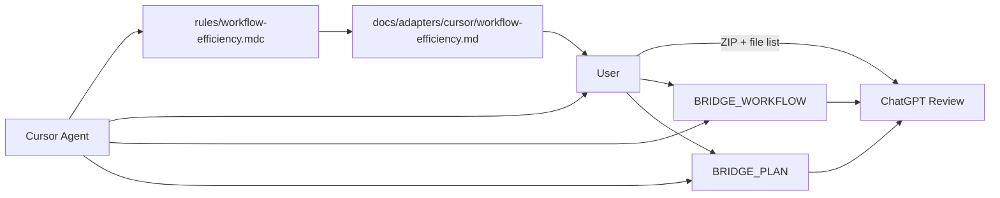
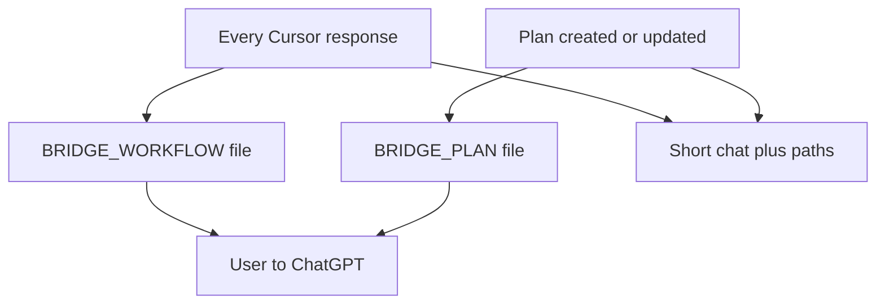

# Bridge — Workflow Efficiency Rules

**Status:** Active  
**Purpose:** Make the Cursor → User → ChatGPT loop faster with less copy/paste and less uncertainty.  
**Enforcement rule:** [rules/workflow-efficiency.mdc](../../../rules/workflow-efficiency.mdc) (`alwaysApply: true`)

This document is the **canonical human-readable spec**. The Cursor rule is the **enforcement summary**. Both must stay aligned.

This spec **extends** global RF/WF user rules. It does not replace RF headers or end lines.

---

## Loop overview



---

## 0. Handoff files — BRIDGE filename law

All handoff files live under:

```
chatgpt_files/cursor_responses/
```

Permanent **chronological audit/handoff protocol** for User and ChatGPT.

### BRIDGE_WORKFLOW vs BRIDGE_PLAN

| Type | Fixed segment | When | Main content |
|------|---------------|------|--------------|
| **WORKFLOW** | `BRIDGE_WORKFLOW` | Every Cursor response | Full Cursor answer |
| **PLAN** | `BRIDGE_PLAN` | Plan created or updated | Full plan body |

A **Plan Mode turn** may produce **both** files:

1. `BRIDGE_WORKFLOW` — answer handoff (chat may be short)
2. `BRIDGE_PLAN` — full plan (`PLAN_CREATED`, `PLAN_REVIEWED`, `FINAL_PLAN_CANDIDATE`, plan changed)



### Shared rules (both types)

**Never use 4-digit HHMM.** Time is always **HHMMSS** (exactly 6 digits, local time).

**Character rules:** `A-Z`, `a-z`, `0-9`, hyphen, underscore only. No spaces, colons, or other special characters.

**Uniqueness and retention:**

| Rule | Requirement |
|------|-------------|
| Overwrite | **Never** |
| Collision | Append `_01`, `_02`, `_03`, … until unique |
| Delete | **Never** |
| Move | **Never** to `chatgpt_files/analysed/` |
| Legacy | Old files without `BRIDGE_*` stay unchanged |

### 0a — BRIDGE_WORKFLOW filename pattern

```
YYYY-MM-DD_HHMMSS_BRIDGE_WORKFLOW_<ID>_<cursor-topic>.md
```

| Segment | Rule | Example |
|---------|------|---------|
| Date | `YYYY-MM-DD` | `2026-05-28` |
| Time | `HHMMSS` (6 digits) | `065234` |
| Fixed | `BRIDGE` | `BRIDGE` |
| Fixed | `WORKFLOW` | `WORKFLOW` |
| `<ID>` | Current work ID — **not** `WORKFLOW` or `PLAN` | `P2-1-pre-1`, `P2-1a`, `Git-Checkpoint`, `CI-Fix`, `GENERAL` |
| `<cursor-topic>` | Cursor-defined | `execution-done_visual-foundation` |
| Collision | before `.md` | `_01`, `_02` |

**Examples:**

- `2026-05-28_065234_BRIDGE_WORKFLOW_P2-1-pre-1_execution-done_visual-foundation.md`
- `2026-05-28_070012_BRIDGE_WORKFLOW_P2-1-pre-report_plan-created_git-checkpoint.md`
- `2026-05-28_070045_BRIDGE_WORKFLOW_GENERAL_test_response-file-handoff.md`
- `2026-05-28_073606_BRIDGE_WORKFLOW_GENERAL_execution-done_bridge-plan-handoff-law.md`

**Must contain:** Task, Phase, Workflow, Mode, full Cursor response, NEXT ACTION.

### 0b — BRIDGE_PLAN filename pattern

```
YYYY-MM-DD_HHMMSS_BRIDGE_PLAN_<ID>_<cursor-topic>.md
```

| Segment | Rule | Example |
|---------|------|---------|
| Date | `YYYY-MM-DD` | `2026-05-28` |
| Time | `HHMMSS` (6 digits) | `071500` |
| Fixed | `BRIDGE` | `BRIDGE` |
| Fixed | `PLAN` | `PLAN` |
| `<ID>` | Current work ID — **not** `WORKFLOW` or `PLAN` | `P2-1a`, `Git-Checkpoint`, `CI-Fix`, `GENERAL` |
| `<cursor-topic>` | Cursor-defined | `plan-created_cross-cutting-components` |
| Collision | before `.md` | `_01`, `_02` |

**Trigger:** `PLAN_CREATED`, `PLAN_REVIEWED`, `FINAL_PLAN_CANDIDATE`, or plan file newly created/updated.

**`<ID>` must not duplicate category:** use `GENERAL` for general workflow-rule work, not `WORKFLOW` or `PLAN`. Forbidden: `BRIDGE_WORKFLOW_WORKFLOW_...`, `BRIDGE_PLAN_WORKFLOW_...`, `BRIDGE_PLAN_PLAN_...`.

**Examples:**

- `2026-05-28_071500_BRIDGE_PLAN_P2-1a_plan-created_cross-cutting-components.md`
- `2026-05-28_071630_BRIDGE_PLAN_GENERAL_plan-reviewed_push-workflow-rules.md`
- `2026-05-28_071730_BRIDGE_PLAN_Git-Checkpoint_final-plan-candidate_report-commit.md`
- `2026-05-28_073606_BRIDGE_PLAN_GENERAL_execution-done_bridge-plan-handoff-demo.md`

**Must contain:** Task, Phase, Workflow, Mode, **full plan** (not summary), NEXT ACTION.

**Include when applicable (both types):** git stand, scope, files, abort conditions, tests, staging/push plan, changed/created files, `git status --short`, forbidden paths, review bundle, CI status/logs.

### Chat rules

- Chat **may be short** — files hold full content
- **Always** state exact path(s) of newly saved file(s)
- Plan Mode with new/changed plan: state **both** WORKFLOW and PLAN paths when both created
- **No exceptions** except write failure

### WORKFLOW file template

```markdown
# Cursor Response

- **Task:** ...
- **Filename:** YYYY-MM-DD_HHMMSS_BRIDGE_WORKFLOW_<ID>_<cursor-topic>.md
- **Saved at:** YYYY-MM-DD HH:MM:SS (local)

---

<full Cursor response body>
```

### PLAN file template

```markdown
# Cursor Plan Handoff

- **Task:** ...
- **Filename:** YYYY-MM-DD_HHMMSS_BRIDGE_PLAN_<ID>_<cursor-topic>.md
- **Saved at:** YYYY-MM-DD HH:MM:SS (local)

---

<full plan body>

---

NEXT ACTION:
...
```

### Legacy files

Files under older naming (without `BRIDGE_WORKFLOW` / `BRIDGE_PLAN`) **remain unchanged**.

**Wrong-ID legacy demos** (do not rename/delete — error examples only):

- `..._BRIDGE_WORKFLOW_WORKFLOW_...`
- `..._BRIDGE_PLAN_WORKFLOW_...`

### Exclude from review ZIPs

Handoff files under `chatgpt_files/cursor_responses/` — include in ZIP only when explicitly requested. Do not prune or archive routinely.

---

## 1. NEXT ACTION (every Cursor response)

Every Cursor response ends with this block (after main content, before RF end line):

```markdown
NEXT ACTION:
- Mode: Plan | Agent | Ask
- User action: <one clear action>
- Blocked by: <what is missing, or "none">
- Suggested prompt/action: <copy-paste-ready prompt or command>
```

### Mode mapping

| Workflow state | Mode | Typical user action |
|----------------|------|---------------------|
| PLAN_CREATED | Plan | Reply `PLAN_REVIEWED` or request corrections |
| PLAN_REVIEWED | Plan | Confirm `FINAL_PLAN_CONFIRMED` or refine scope |
| FINAL_PLAN_CONFIRMED | Agent | Start execution (Agent button) |
| EXECUTION_DONE | Plan / Agent | Review output; request fixes or approve |
| REVIEW_DONE | Plan | Request next phase `PLAN_CREATED` |

### Example (after a plan)

```markdown
NEXT ACTION:
- Mode: Plan
- User action: Review plan and reply PLAN_REVIEWED or request corrections
- Blocked by: none
- Suggested prompt/action: PLAN_REVIEWED — Workflow Efficiency Rules. Bitte FINAL_PLAN_CANDIDATE erstellen.
```

---

## 2. EXECUTION_DONE report (standard fields)

Every execution completion must include:

| Field | Description |
|-------|-------------|
| changed files | Explicit list, or `none` |
| created files | Explicit list, or `none` |
| tests run | Command + pass/fail count, or `none` |
| git status --short | Verbatim output, or `clean` |
| forbidden paths touched | `yes/no` — if yes, list paths |
| review bundle recommendation | Short pointer to REVIEW_READY section |
| next safe step | One sentence |

### Example

```markdown
## Execution report

- **changed files:** none
- **created files:** rules/workflow-efficiency.mdc, docs/adapters/cursor/workflow-efficiency.md
- **tests run:** none (docs-only)
- **git status --short:** ?? rules/workflow-efficiency.mdc, ?? docs/adapters/cursor/workflow-efficiency.md
- **forbidden paths touched:** no
- **review bundle recommendation:** see REVIEW_READY below
- **next safe step:** Review both files; then plan Git checkpoint if approved
```

### Standard forbidden paths (when out of scope)

| Path | Reason |
|------|--------|
| `web/` | Product shell — separate phase |
| `api/src/` (runtime) | P0 pipeline frozen unless scoped |
| `adapters/cursor/src/` | Adapter runtime — separate phase |
| `shared/` | Shared contract — separate phase |
| `packages/ui-cursor/` | Renderer scaffold — P2.1b+ |
| `package.json`, `package-lock.json` | Only when explicitly scoped |
| `.github/workflows/` | CI changes need explicit approval |
| `packages/ui/preview/dist/` | Build artifact |
| `packages/ui/preview/review-artifacts/` | Local review screenshots |
| `bridge.version.json`, `integrations/catalog.json` | Build side effects — revert after `npm run build` |

---

## 3. REVIEW_READY (upload / ZIP guidance)

When marking REVIEW_READY, always include:

### exact files to upload

List every file ChatGPT should review — explicit paths, no vague globs.

### suggested ZIP name

```
bridge-{phase}-{YYYYMMDD}-review.zip
```

Examples:

- `bridge-p2.1-pre-20260528-review.zip`
- `bridge-workflow-efficiency-20260528-review.zip`

### files/folders to exclude

```
node_modules/
dist/
packages/ui/preview/dist/
packages/ui/preview/review-artifacts/
.env
bridge.version.json
integrations/catalog.json
.git/
```

**Include guidance:**

- Scope files only + relevant docs/tests
- Docs-only phase: report file (+ plan export if used)
- Do not include `package-lock.json` unless lockfile change was in scope

### Example (docs-only workflow rules)

```markdown
REVIEW_READY: yes

**Upload for ChatGPT:**
- rules/workflow-efficiency.mdc
- docs/adapters/cursor/workflow-efficiency.md

**Suggested ZIP:** bridge-workflow-efficiency-20260528-review.zip

**Exclude:** node_modules/, dist/, .git/, bridge.version.json, integrations/catalog.json
```

---

## 4. Git checkpoint plan (template)

Every Git checkpoint plan must contain:

### exact staging list

```text
git add rules/workflow-efficiency.mdc
git add docs/adapters/cursor/workflow-efficiency.md
```

Never `git add -A`, `git add .`, or `git add docs/` unless explicitly approved.

### forbidden files

List what must **not** appear in the commit (see forbidden paths table above).

### pre-commit checks

```powershell
git status --short
git diff --stat
git diff --cached --stat
git branch --show-current
```

Abort if anything outside the staging list is modified or untracked (except explicitly allowed artifacts).

### post-commit checks

```powershell
git show --stat HEAD
git status --short
git rev-list --count origin/main..HEAD
git log -1 --oneline
```

Expect: only staged files in commit; working tree clean; ahead count matches plan.

### push yes/no

Always explicit:

- `push: no (separate push plan required)`, or
- link to a dedicated push plan

### PowerShell commit

Use simple `-m` only — **no HEREDOC**:

```powershell
git commit -m "docs(cursor): add workflow efficiency rules"
```

---

## 5. Push plan (template)

Every push plan must contain:

### exact commits ahead

| SHA | Message |
|-----|---------|
| `<sha>` | `<message>` |

Verify with:

```powershell
git fetch origin
git log --oneline origin/main..HEAD
git rev-list --count origin/main..HEAD
```

### fast-forward check

- Branch must be `main`
- Working tree clean
- `origin/main..HEAD` contains exactly the planned commit(s)
- Remote not ahead of local
- Abort if push would not be fast-forward

### CI expected run

Push to `main` triggers [P2 Foundation](../../../.github/workflows/p2-foundation.yml):

1. `npm ci`
2. `npm run validate:ui-modules`
3. `npm run generate:control-tokens`
4. `git diff --exit-code packages/ui/src/generated/`
5. `npm run test:p2-ui`
6. `npm run test:p0`
7. `npm run build`

Docs-only commits still trigger the full workflow.

### how to report CI result

After push, report:

| Field | Source |
|-------|--------|
| Push exit status | `git push origin main` |
| CI started | yes/no |
| Run number | e.g. Run #6 |
| Head SHA | commit pushed |
| Status | `in_progress` / `success` / `failure` |
| URL | `https://github.com/boboneulichedl-code/bridge/actions/runs/<id>` |

If `gh` is unavailable, use GitHub Actions UI or API:

```
GET /repos/boboneulichedl-code/bridge/actions/runs?branch=main&per_page=1
```

### push command

```powershell
git push origin main
```

No `--force` unless explicitly approved.

---

## 6. Reference example (P2.1-pre)

| Step | Detail |
|------|--------|
| Feature commits | `b330fe8` (pre-0), `f7e1d7a` (pre-1) |
| Report commit | `5ccec91` — `docs(ui): add P2.1-pre completion report` |
| Push | `f7e1d7a..5ccec91` fast-forward |
| CI | P2 Foundation Run #6 — triggered on docs push |

See [p2.1-pre-completion-report.md](p2.1-pre-completion-report.md) for phase deliverables.

---

## 7. Maintenance

When updating workflow rules:

1. Edit this doc first (canonical spec)
2. Sync [rules/workflow-efficiency.mdc](../../../rules/workflow-efficiency.mdc) summary
3. Keep examples current with BRIDGE_WORKFLOW and BRIDGE_PLAN filename schemas
4. Commit workflow rule files together in a docs-only checkpoint
5. `chatgpt_files/cursor_responses/` — response logs; commit only when explicitly scoped
